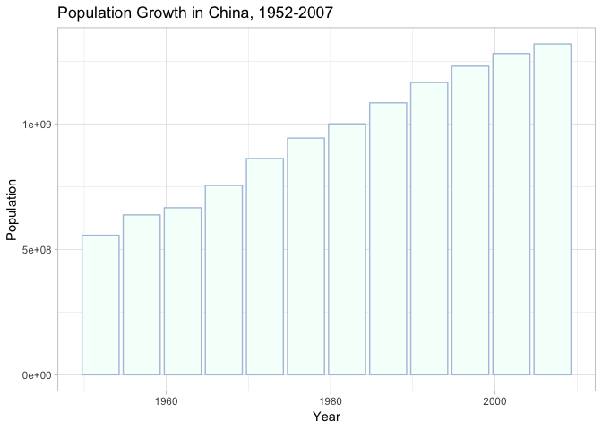

```r
dev.new()
```

## Instructions
Answer the following questions and complete the exercises in RMarkdown. Please embed all of your code, keep track of your versions using git, and push your final work to our [GitHub repository](https://github.com/FRS417-DataScienceBiologists). I will randomly select a few examples of student work at the start of each session to use as examples so be sure that your code is working to the best of your ability.

## Load the libraries

```r
library(tidyverse)
library(skimr)
library("RColorBrewer")
```

## Resources
The idea for this assignment came from [Rebecca Barter's](http://www.rebeccabarter.com/blog/2017-11-17-ggplot2_tutorial/) ggplot tutorial so if you get lost go have a look. Please do not copy and paste her code!  

## Gapminder
For this assignment, we are going to use the dataset [gapminder](https://cran.r-project.org/web/packages/gapminder/index.html). Gapminder includes information about economics, population, and life expectancy from countries all over the world. You will need to install it before use.

```r
install.packages("gapminder")
```

```
## Error in contrib.url(repos, "source"): trying to use CRAN without setting a mirror
```


```r
library("gapminder")
```

Please load the data into a new object called gapminder.

```r
gapminder <- 
  gapminder::gapminder
```

1. Explore the data using the various functions you have learned. Is it tidy, are there any NA's, what are its dimensions, what are the column names, etc.


```r
glimpse(gapminder)
```

```
## Observations: 1,704
## Variables: 6
## $ country   <fct> Afghanistan, Afghanistan, Afghanistan, Afghanistan, Af…
## $ continent <fct> Asia, Asia, Asia, Asia, Asia, Asia, Asia, Asia, Asia, …
## $ year      <int> 1952, 1957, 1962, 1967, 1972, 1977, 1982, 1987, 1992, …
## $ lifeExp   <dbl> 28.801, 30.332, 31.997, 34.020, 36.088, 38.438, 39.854…
## $ pop       <int> 8425333, 9240934, 10267083, 11537966, 13079460, 148803…
## $ gdpPercap <dbl> 779.4453, 820.8530, 853.1007, 836.1971, 739.9811, 786.…
```


```r
names(gapminder)
```

```
## [1] "country"   "continent" "year"      "lifeExp"   "pop"       "gdpPercap"
```

```r
plot(gapminder)
```

<!-- -->
This data is tidy.


```r
gapminder
```

```
## # A tibble: 1,704 x 6
##    country     continent  year lifeExp      pop gdpPercap
##    <fct>       <fct>     <int>   <dbl>    <int>     <dbl>
##  1 Afghanistan Asia       1952    28.8  8425333      779.
##  2 Afghanistan Asia       1957    30.3  9240934      821.
##  3 Afghanistan Asia       1962    32.0 10267083      853.
##  4 Afghanistan Asia       1967    34.0 11537966      836.
##  5 Afghanistan Asia       1972    36.1 13079460      740.
##  6 Afghanistan Asia       1977    38.4 14880372      786.
##  7 Afghanistan Asia       1982    39.9 12881816      978.
##  8 Afghanistan Asia       1987    40.8 13867957      852.
##  9 Afghanistan Asia       1992    41.7 16317921      649.
## 10 Afghanistan Asia       1997    41.8 22227415      635.
## # … with 1,694 more rows
```


```r
head(gapminder)
```

```
## # A tibble: 6 x 6
##   country     continent  year lifeExp      pop gdpPercap
##   <fct>       <fct>     <int>   <dbl>    <int>     <dbl>
## 1 Afghanistan Asia       1952    28.8  8425333      779.
## 2 Afghanistan Asia       1957    30.3  9240934      821.
## 3 Afghanistan Asia       1962    32.0 10267083      853.
## 4 Afghanistan Asia       1967    34.0 11537966      836.
## 5 Afghanistan Asia       1972    36.1 13079460      740.
## 6 Afghanistan Asia       1977    38.4 14880372      786.
```


2. We are interested in the relationship between per capita GDP and life expectancy; i.e. does having more money help you live longer on average. Make a quick plot below to visualize this relationship.


```r
gapminder %>% 
ggplot(aes(x=lifeExp, y=gdpPercap)) +
  geom_point()+
  labs(title = "Per Capita GDP vs. Life Expectancy",
       x = "Life Expectancy",
       y = "Per Capita GDP")+ 
  geom_smooth(method=lm, se=FALSE, color="limegreen")
```

<!-- -->


3. There is extreme disparity in per capita GDP. Rescale the x axis to make this easier to interpret. How would you characterize the relationship?


```r
library("paletteer")
colors <-
  paletteer::palettes_d_names
```

```r
my_palette <-
  paletteer_d(package="palettetown", palette="sunflora")
barplot(rep(1,14), axes=FALSE, col=my_palette)
```

<!-- -->


```r
gapminder %>% 
  ggplot(aes(x=gdpPercap, y=lifeExp, color=continent)) +
  geom_point()+
  labs(title = "Per Capita GDP vs. Life Expectancy",
       x = "Per Capita GDP",
       y = "Life Expectancy (log 10)")+ 
  geom_smooth(method=lm, color="beige")+
  scale_x_log10()+
  scale_colour_manual(values=my_palette)
```

<!-- -->

There is a positive correlation between the per capita GDP and the life expectancy of the country.

4. This should look pretty dense to you with significant overplotting. Try using a faceting approach to break this relationship down by year.

```r
ggplot(gapminder, aes(x=lifeExp, y=gdpPercap, color=continent)) +
  geom_point()+
  labs(title = "Per Capita GDP vs. Life Expectancy",
       x = "Life Expectancy (log 10)",
       y = "Per Capita GDP")+ 
  geom_smooth(method=lm, se=FALSE, color="beige")+
  scale_y_log10()+
  scale_colour_manual(values=my_palette)+
  facet_wrap(~year)
```

<!-- -->
 
 
5. Simplify the comparison by comparing only 1952 and 2007. Can you come to any conclusions?


```r
gapminder %>% 
  filter(year==1952 | year==2007) %>% 
  ggplot(aes(x=lifeExp, y=gdpPercap, color=continent)) +
  geom_point()+
  labs(title = "Per Capita GDP vs. Life Expectancy",
       x = "Life Expectancy",
       y = "Per Capita GDP")+ 
  geom_smooth(method=lm, se=FALSE, color="beige")+
  scale_y_log10()+
  scale_colour_manual(values=my_palette)+
  facet_wrap(~year)
```

<!-- -->
The relationship between GDP and life expectancy became more extreme. The slope became more positive.

6. Let's stick with the 1952 and 2007 comparison but make some aesthetic adjustments. First try to color by continent and adjust the size of the points by population. Add `+ scale_size(range = c(0.1, 10), guide = "none")` as a layer to clean things up a bit.


```r
gapminder %>% 
  filter(year==1952 | year==2007) %>% 
  ggplot(aes(x=lifeExp, y=gdpPercap, color=continent)) +
  geom_point()+
  labs(title = "Per Capita GDP vs. Life Expectancy",
       x = "Life Expectancy",
       y = "Per Capita GDP")+ 
  geom_smooth(method=lm, se=FALSE, color="darkgrey")+
  scale_y_log10()+
  scale_colour_manual(values=my_palette)+
  scale_size(range = c(0.1, 10), guide = "none")+
  facet_wrap(~year)
```

<!-- -->

7. Although we did not introduce them in lab, ggplot has a number of built-in themes that make things easier. I like the light theme for these data, but you can see lots of options. Apply one of these to your plot above.

```r
?theme_light
```


```r
gapminder %>% 
  filter(year==1952 | year==2007) %>% 
  ggplot(aes(x=lifeExp, y=gdpPercap, color=continent, size=pop)) +
  geom_point()+
  labs(title = "Per Capita GDP vs. Life Expectancy",
       x = "Life Expectancy",
       y = "Per Capita GDP")+ 
  geom_smooth(method=lm, se=FALSE, color="darkgrey")+
  scale_y_log10()+
  scale_colour_manual(values=my_palette)+
  scale_size(range = c(0.1, 10), guide = "none")+
  facet_wrap(~year)+
  theme_light()
```

<!-- -->
8. What is the population for all countries on the Asian continent in 2007? Show this as a barplot.


```r
gapminder %>% 
filter(year==2007, continent=="Asia") %>% 
  ggplot(aes(x=reorder(country, -pop), y=pop))+
  geom_col(fill="gold")+
  labs(title = "Population of Countries in Asia, 2007",
       x = "Country",
       y = "Population")+ 
  coord_flip()+
  theme(plot.title = element_text(size = rel(1.25), hjust = 0.5))
```

<!-- -->

9. You should see that China's population is the largest with India a close second. Let's focus on China only. Make a plot that shows how population has changed over the years.


```r
gapminder %>%
  filter(country=="China") %>% 
  ggplot(aes(x=year, y=pop))+
  geom_bar(stat="identity", color="light steel blue", fill="mint cream")+
  labs(title = "Population Growth in China, 1952-2007",
       x = "Year",
       y = "Population")+
  theme_light()
```

<!-- -->


10. Let's compare China and India. Make a barplot that shows population growth by year using `position=dodge`. Apply a custom color theme using RColorBrewer.


```r
gapminder %>%
  filter(country=="China" | country=="India") %>% 
  ggplot(aes(x=year, y=pop, fill=country))+
  geom_bar(stat="identity", position="dodge", color="olive drab", alpha=.6)+
  scale_fill_brewer(palette = "BrBG")+
  labs(title = "Population Growth in China and India, 1952-2007",
       x = "Year",
       y = "Population")+
  theme_minimal()
```

<!-- -->

## Push your final code to [GitHub](https://github.com/FRS417-DataScienceBiologists)
Make sure that you push your code into the appropriate folder. Also, be sure that you have check the `keep md` file in the knit preferences.
