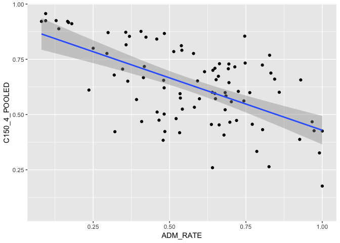
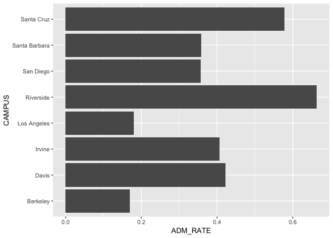

## Instructions
This exam is designed to show me what you have learned and where there are problems. You may use your notes and anything from the `class_files` folder, but please no internet searches. You have 35 minutes to complete as many of these exercises as possible on your own, and 10 minutes to work with a partner.  

At the end of the exam, upload the complete .Rmd file to your GitHub repository.  

1. Load the tidyverse.


```r
library(tidyverse)
library(skimr)
```


2. For these questions, we will use data about California colleges. Load the `ca_college_data.csv` as a new object called `colleges`.


```r
colleges <- 
  readr::read_csv("data/ca_college_data.csv")
```

3. Use your preferred function to have a look at the data and get an idea of its structure.

```r
colleges %>% 
    skimr::skim()
```

```
## Skim summary statistics
##  n obs: 341 
##  n variables: 10 
## 
## ── Variable type:character ─────────────────────────────────────────────────────────────────────────────────────────────────────────────────
##  variable missing complete   n min max empty n_unique
##      CITY       0      341 341   4  19     0      161
##    INSTNM       0      341 341  10  63     0      341
##    STABBR       0      341 341   2   2     0        3
##       ZIP       0      341 341   5  10     0      324
## 
## ── Variable type:numeric ───────────────────────────────────────────────────────────────────────────────────────────────────────────────────
##       variable missing complete   n     mean        sd        p0      p25
##       ADM_RATE     240      101 341     0.59     0.23     0.081      0.46
##  C150_4_POOLED     221      120 341     0.57     0.21     0.062      0.43
##       COSTT4_A     124      217 341 26685.17 18122.7   7956      12578   
##         PCIP26      35      306 341     0.02     0.038    0          0   
##    PFTFTUG1_EF      53      288 341     0.56     0.29     0.0064     0.32
##        SAT_AVG     276       65 341  1112.31   170.8    870        985   
##       p50       p75     p100     hist
##      0.64     0.75      1    ▃▂▅▇▆▇▅▃
##      0.58     0.72      0.96 ▁▃▃▆▇▇▃▅
##  16591    39289     69355    ▇▃▁▂▁▁▁▁
##      0        0.025     0.22 ▇▁▁▁▁▁▁▁
##      0.5      0.81      1    ▁▅▇▆▃▅▃▇
##   1078     1237      1555    ▆▇▅▃▃▂▂▁
```

```r
glimpse(colleges)
```

```
## Observations: 341
## Variables: 10
## $ INSTNM        <chr> "Grossmont College", "College of the Sequoias", "C…
## $ CITY          <chr> "El Cajon", "Visalia", "San Mateo", "Ventura", "Ox…
## $ STABBR        <chr> "CA", "CA", "CA", "CA", "CA", "CA", "CA", "CA", "C…
## $ ZIP           <chr> "92020-1799", "93277-2214", "94402-3784", "93003-3…
## $ ADM_RATE      <dbl> NA, NA, NA, NA, NA, NA, NA, NA, NA, NA, NA, NA, NA…
## $ SAT_AVG       <dbl> NA, NA, NA, NA, NA, NA, NA, NA, NA, NA, NA, NA, NA…
## $ PCIP26        <dbl> 0.0016, 0.0066, 0.0038, 0.0035, 0.0085, 0.0151, 0.…
## $ COSTT4_A      <dbl> 7956, 8109, 8278, 8407, 8516, 8577, 8580, 9181, 92…
## $ C150_4_POOLED <dbl> NA, NA, NA, NA, NA, NA, 0.2334, NA, NA, NA, NA, 0.…
## $ PFTFTUG1_EF   <dbl> 0.3546, 0.5413, 0.3567, 0.3824, 0.2753, 0.4286, 0.…
```

4. What are the column names?

```r
names(colleges)
```

```
##  [1] "INSTNM"        "CITY"          "STABBR"        "ZIP"          
##  [5] "ADM_RATE"      "SAT_AVG"       "PCIP26"        "COSTT4_A"     
##  [9] "C150_4_POOLED" "PFTFTUG1_EF"
```

5. Are there any NA's in the data? If so, how many are present and in which variables?


```r
colleges %>%
  purrr::map_df(~ sum(is.na(.)))%>% 
  tidyr::gather(variables, num_nas) %>% 
  arrange(desc(num_nas))
```

```
## # A tibble: 10 x 2
##    variables     num_nas
##    <chr>           <int>
##  1 SAT_AVG           276
##  2 ADM_RATE          240
##  3 C150_4_POOLED     221
##  4 COSTT4_A          124
##  5 PFTFTUG1_EF        53
##  6 PCIP26             35
##  7 INSTNM              0
##  8 CITY                0
##  9 STABBR              0
## 10 ZIP                 0
```


6. Which cities in California have the highest number of colleges?

```r
colleges %>% 
  group_by(CITY) %>% 
  summarize(total=n()) %>% 
  arrange(desc(total))
```

```
## # A tibble: 161 x 2
##    CITY          total
##    <chr>         <int>
##  1 Los Angeles      24
##  2 San Diego        18
##  3 San Francisco    15
##  4 Sacramento       10
##  5 Berkeley          9
##  6 Oakland           9
##  7 Claremont         7
##  8 Pasadena          6
##  9 Fresno            5
## 10 Irvine            5
## # … with 151 more rows
```


7. The column `COSTT4_A` is the annual cost of each institution. Which city has the highest cost?


```r
colleges %>% 
  group_by(CITY) %>% 
  summarize(mean_cost_yr=mean(COSTT4_A, na.rm=TRUE),
            total=n()) %>% 
  arrange(desc(mean_cost_yr))
```

```
## # A tibble: 161 x 3
##    CITY                mean_cost_yr total
##    <chr>                      <dbl> <int>
##  1 Claremont                  66498     7
##  2 Malibu                     66152     1
##  3 Valencia                   64686     1
##  4 Orange                     64501     3
##  5 Redlands                   61542     1
##  6 Moraga                     61095     1
##  7 Atherton                   56035     1
##  8 Thousand Oaks              54373     1
##  9 Rancho Palos Verdes        50758     1
## 10 La Verne                   50603     1
## # … with 151 more rows
```


8. The column `ADM_RATE` is the admissions rate by college and `C150_4_POOLED` is the four-year completion rate. Use a scatterplot to show the relationship between these two variables. What does this mean?

```r
colleges %>% 
  ggplot(aes(x=ADM_RATE, y=C150_4_POOLED))+
  geom_point()+
  geom_smooth(method=lm)
```

```
## Warning: Removed 251 rows containing non-finite values (stat_smooth).
```

```
## Warning: Removed 251 rows containing missing values (geom_point).
```

<!-- -->


9. The column titled `INSTNM` is the institution name. We are only interested in the University of California colleges. Run the code below and look at the output. Are all of the columns tidy? Why or why not?


```r
univ_calif <-
  colleges %>% 
  filter_all(any_vars(str_detect(., pattern = "University of California")))
univ_calif
```

```
## # A tibble: 10 x 10
##    INSTNM CITY  STABBR ZIP   ADM_RATE SAT_AVG PCIP26 COSTT4_A C150_4_POOLED
##    <chr>  <chr> <chr>  <chr>    <dbl>   <dbl>  <dbl>    <dbl>         <dbl>
##  1 Unive… La J… CA     92093    0.357    1324  0.216    31043         0.872
##  2 Unive… Irvi… CA     92697    0.406    1206  0.107    31198         0.876
##  3 Unive… Rive… CA     92521    0.663    1078  0.149    31494         0.73 
##  4 Unive… Los … CA     9009…    0.180    1334  0.155    33078         0.911
##  5 Unive… Davis CA     9561…    0.423    1218  0.198    33904         0.850
##  6 Unive… Sant… CA     9506…    0.578    1201  0.193    34608         0.776
##  7 Unive… Berk… CA     94720    0.169    1422  0.105    34924         0.916
##  8 Unive… Sant… CA     93106    0.358    1281  0.108    34998         0.816
##  9 Unive… San … CA     9410…   NA          NA NA           NA        NA    
## 10 Unive… San … CA     9414…   NA          NA NA           NA        NA    
## # … with 1 more variable: PFTFTUG1_EF <dbl>
```


10. Use `separate()` to separate institution name into two new columns "UNIV" and "CAMPUS".


```r
univ_calif <- 
  univ_calif %>% 
  separate(INSTNM, into= c("UNIV", "CAMPUS"), sep="-")
univ_calif
```

```
## # A tibble: 10 x 11
##    UNIV  CAMPUS CITY  STABBR ZIP   ADM_RATE SAT_AVG PCIP26 COSTT4_A
##    <chr> <chr>  <chr> <chr>  <chr>    <dbl>   <dbl>  <dbl>    <dbl>
##  1 Univ… San D… La J… CA     92093    0.357    1324  0.216    31043
##  2 Univ… Irvine Irvi… CA     92697    0.406    1206  0.107    31198
##  3 Univ… River… Rive… CA     92521    0.663    1078  0.149    31494
##  4 Univ… Los A… Los … CA     9009…    0.180    1334  0.155    33078
##  5 Univ… Davis  Davis CA     9561…    0.423    1218  0.198    33904
##  6 Univ… Santa… Sant… CA     9506…    0.578    1201  0.193    34608
##  7 Univ… Berke… Berk… CA     94720    0.169    1422  0.105    34924
##  8 Univ… Santa… Sant… CA     93106    0.358    1281  0.108    34998
##  9 Univ… Hasti… San … CA     9410…   NA          NA NA           NA
## 10 Univ… San F… San … CA     9414…   NA          NA NA           NA
## # … with 2 more variables: C150_4_POOLED <dbl>, PFTFTUG1_EF <dbl>
```

11. As a final step, remove `Hastings College of Law` and `UC San Francisco` and store the final data frame as a new object `univ_calif_final`.


```r
univ_calif_final <- 
  univ_calif %>% 
  filter(CAMPUS !="Hastings College of Law",
         CAMPUS !="San Francisco")
univ_calif_final
```

```
## # A tibble: 8 x 11
##   UNIV  CAMPUS CITY  STABBR ZIP   ADM_RATE SAT_AVG PCIP26 COSTT4_A
##   <chr> <chr>  <chr> <chr>  <chr>    <dbl>   <dbl>  <dbl>    <dbl>
## 1 Univ… San D… La J… CA     92093    0.357    1324  0.216    31043
## 2 Univ… Irvine Irvi… CA     92697    0.406    1206  0.107    31198
## 3 Univ… River… Rive… CA     92521    0.663    1078  0.149    31494
## 4 Univ… Los A… Los … CA     9009…    0.180    1334  0.155    33078
## 5 Univ… Davis  Davis CA     9561…    0.423    1218  0.198    33904
## 6 Univ… Santa… Sant… CA     9506…    0.578    1201  0.193    34608
## 7 Univ… Berke… Berk… CA     94720    0.169    1422  0.105    34924
## 8 Univ… Santa… Sant… CA     93106    0.358    1281  0.108    34998
## # … with 2 more variables: C150_4_POOLED <dbl>, PFTFTUG1_EF <dbl>
```

12. The column `ADM_RATE` is the admissions rate by campus. Which UC has the lowest and highest admissions rates? Please use a barplot.


```r
univ_calif %>% 
  filter(CAMPUS !="Hastings College of Law",
         CAMPUS !="San Francisco") %>% 
  ggplot(aes(x=CAMPUS, y=ADM_RATE))+
  geom_bar(stat="identity")+
  coord_flip()
```

<!-- -->
## Knit Your Output and Post to [GitHub](https://github.com/FRS417-DataScienceBiologists)
